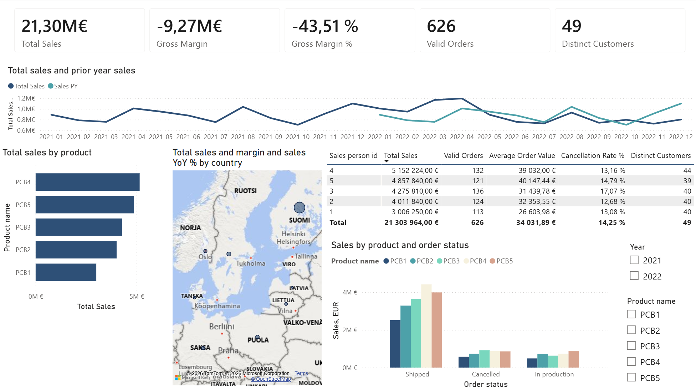
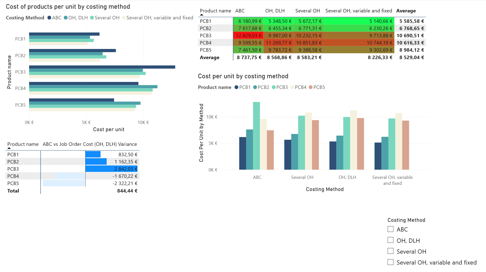
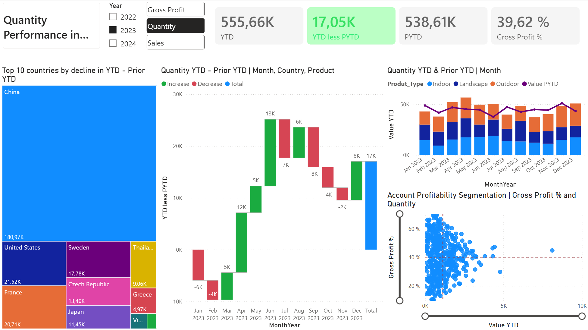

# Data Analytics Portfolio

Three end-to-end projects covering the three prediction problems you'll likely face in data- and business-analytics: classification, regression, and time-series forecasting.

## At a Glance

| Project | Problem | Model | Result |
|---|---|---|---|
| [Customer Churn](#1-customer-churn--classification) | Classification | LightGBM + Optuna | 0.85 ROC AUC |
| [Insurance Premiums](#2-vehicle-insurance-premiums--regression) | Regression | XGBoost + Optuna | 3.4% avg error |
| [Retail Sales](#3-retail-sales--time-series-forecasting) | Time series | XGBoost + Ridge hybrid | 0.410 RMSLE (beat baseline) |

Plus two Power BI dashboards (`Power BI Project Sales Report.pbix`, `Power BI Sales and Costing Report.pbix`) built to analyze performance, trends, and costing methods.

**Stack:** Python (pandas, scikit-learn, LightGBM, XGBoost, Optuna), Power BI. Each notebook runs top to bottom: cleaning → EDA → modelling → tuning → evaluation → summary.

---

## 1. Customer Churn — Classification

Telecom churn prediction, tuned LightGBM (Optuna, 50 trials, 5-fold CV).

**Key finding:** contract type dominates everything else. Churn decreases steeply with increases in contract length, from 42.7% (month-to-month), 11.3% (one-year), 2.8% (two-year). Missing add-ons like online security or tech support are also strong signals. An engineered "average monthly charge" feature also mattered.

**Result:** 0.85 ROC AUC, ~80% accuracy, but at the default threshold the model catches 90% of non-churners and ~50% of actual churners. That is a class-imbalance issue, not a model-quality issue, and I explain why a real retention campaign should threshold on predicted probability rather than the default 0.5 cutoff to catch more actual churners (i.e. optimize recall), since missing a churner is usually costlier to the business than a false alarm.

## 2. Vehicle Insurance Premiums — Regression

Premium prediction for an actual insurer using XGBoost with Optuna hyperparameter tuning and a log-transformed target.

**Key finding:** vehicle characteristics such as power, vehicle value, weight, and length show substantially stronger associations with premium than the available claims-history variables. `N_doors` was the strongest feature in the fitted XGBoost model, possibly reflecting broader vehicle-category information rather than a direct effect of door count.

**Result:** the current model achieved a cross-validated RMSE of approximately 0.253 on the log-transformed premium target. On the held-out test set, the mean signed error was about -11.38€ and the median signed percentage error was about +1.0%, with larger errors concentrated among the highest-premium policies.

## 3. Retail Sales — Time Series Forecasting

Store/product-level sales forecasting built from six source tables. Oil prices needed a full calendar reindex before interpolation (gaps are missing trading days, not missing values).

**Key finding:** recent sales history (7/14/28-day rolling means, 16–35 day lags) dominates the signal, followed by promotions. Calendar effects are real but secondary, as weekends run 30–45% above midweek, holidays add another 15–20%.

**Result:** baseline XGBoost hit 0.415 RMSLE. A hybrid model was then tested in three ways: residual boosting (using XGBoost to correct the Ridge model's errors), feature stacking (feeding the Ridge prediction into XGBoost as an extra input), and a weighted blend of both models. Only feature stacking beat the baseline, and even that just slightly (0.410). At this short of a forecast horizon, lag features already encode most of the trend/seasonality signal, so there's limited room left for a separate linear stage to add. Reporting a small, honest win instead of overselling the hybrid was the point of that section.

---

## 4. Power BI Dashboards

### Sales and Costing Report

A 4-page report covering sales performance on an executive summary, customer and salesperson-levels. The report also compares cost accounting methods (activity-based costing vs. job order costing).

**Key finding:** unit costs differ meaningfully between the ABC and job order costing methods. The costing method comparison page lets a decision-maker can see the actual impact on the product cost that the choice of costing method has.

### Sales Performance Dashboard

A single-page executive view of company performance in terms of either gross profit, quantity or sales: YTD vs. prior-YTD comparison by waterfall, top 10 countries by decline, and a scatter view of gross profit % and sales by account. Quickly answers "where did we gain or lose ground this year, and why."
